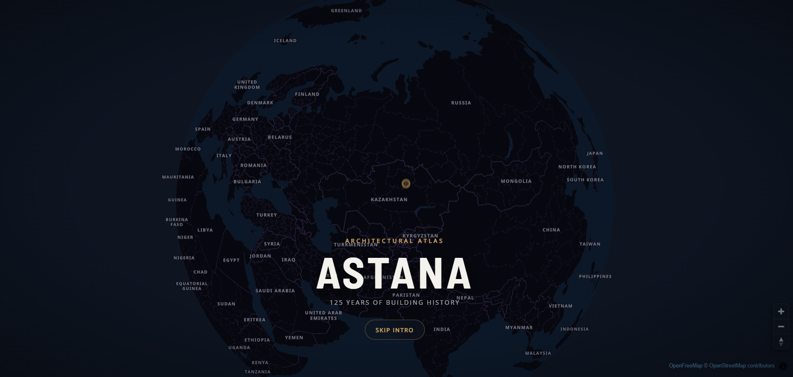

# Astana Building History

> An interactive atlas of every mapped building in Astana, coloured by the era it
> was built in — opening up construction dates, urban heat, elevation and building
> use for a city where that data is scattered, paywalled, or simply absent.

[Live Demo](https://kbh-nu.vercel.app)




## Overview

Astana building history project is an interactive web map showing Astana through buildings in many ways. It combines urban history, culture, design, and climate challenges.

## Table of Contents

- [Project Goals](#project-goals)
- [Key Features](#key-features)
- [Competition Submission](#competition-submission)
- [Map Layers](#map-layers)
- [Data and Methodology](#data-and-methodology)
- [Technology Stack](#technology-stack)
- [Getting Started](#getting-started)
- [Available Scripts](#available-scripts)
- [Project Structure](#project-structure)
- [Architecture](#architecture)
- [Content Guide](#content-guide)
- [Quality and Accessibility](#quality-and-accessibility)
- [Deployment](#deployment)
- [Roadmap](#roadmap)
- [Contributing](#contributing)
- [Credits](#credits)
- [License](#license)

## Project Goals

- Visualizing heavy building data on the web and make it open for anyone
- Architects, public policy makers, map enthusiasts
- The project combine unique features that are rarely can be seen in the experience of web maps. It shows data that is hard to find for Astana (or do not exist at all) — buildings age, construction companies, urban greenness, and many other
- Making building data available

## Key Features

- Interactive 2D and 3D MapLibre map of Astana buildings.
- Construction timeline and animated city-growth playback.
- Historical-era, elevation, land-surface-temperature, building-use, and UHI visualizations.
- Historical reconstruction versus modern map swipe comparison.
- Guided landmark and urban-history tours.
- Building attribute panels and mobile tap previews.
- Narrative stories and contextual content.
- Responsive desktop and mobile interface.
- UPCOMING: Crime data and urban green (rule 3-30-300: 3 trees, 30% of green cover and 300 meters till park)
- UPCOMING: Art of Astana through Murals, graffiti, and other street art
- UPCOMING: More guided tours, improving existing tours
- UPCOMING: More building data (age, construction company, etc.)
- UPCOMING: Storytelling about Astana building heritage

## Map Layers

| Layer / Mode | Purpose | Main attributes | Source |
| --- | --- | --- | --- |
| Year Built | Shows construction periods and historical eras | `year_int`, `year_str`
| Elevation | Shows terrain elevation beneath buildings | `dem_mean`
| Summer Heat | Shows mean summer land surface temperature | `lst_1mean`
| Building Use | Shows primary building function | `type`
| Heat × Age | Combines building age and summer LST | `year_int`, `lst_1mean`
| Historical Comparison | Compares buildings up to 1990 with the modern city | `year_int`
| District Borders | Provides administrative context | `district`

## Data and Methodology

### Data Sources

| Dataset | Provider | Coverage / date | License | Processing notes |
| --- | --- | --- | --- | --- |
| Building footprints | OSM and manual digitizing | Updated: June 2026 | Open Database License (ODbL) | none |
| Construction years | Manual data aggregation | Updated: June 2026 | N/A | none |
| Building heights | none | none | none | none |
| Elevation / DTM | FABDEM | 2015 year | N/A | University of Bristol and Fathom |
| Land surface temperature | Landsat 8 and 9 | 2015-2025 | N/A | none |
| District boundaries | OSM | 2025 year | Open Database License (ODbL) | none |

### Processing Workflow

1. **Source collection.** Building footprints and street context are taken from
   OpenStreetMap and extended by manual digitizing in QGIS against Google Earth
   Pro imagery. Construction years are aggregated by hand from public city
   datasets, property-listing sites, and OSM tags, since no single authoritative
   register of construction dates for Astana is publicly available.
2. **Cleaning and normalization.** Working data is held in GeoPackage. Type and
   district values are normalized to the short codes in the attribute dictionary
   below. Construction years are normalized into `year_int`; where a source gives
   a range, the original text is preserved in `year_str` and the midpoint is used
   for `year_int`. Buildings with no documented year keep `year_int = 0` and
   render as "Unknown" rather than being dropped or guessed.
3. **Spatial joins and derived attributes.** Each footprint is joined to its
   district polygon, to mean ground elevation from FABDEM (`dem_mean`), and to
   mean summer land-surface temperature from Landsat 8/9 (`lst_1mean`). Building
   centroids are separately aggregated into a hexagonal grid carrying a building
   count (`NUMPOINTS`), mean construction year (`year_mean`), and mean height
   (`height_mean_2`) per cell.
4. **Tile generation.** GeoPackage layers are exported to GeoJSON and converted
   to PMTiles with tippecanoe — one archive for building footprints, one for the
   hexagon grid. PMTiles is served as a single static file over HTTP range
   requests, so the map needs no tile server.
5. **Validation.** Datasets are checked for invalid geometries, out-of-range
   years, and duplicate records before tiling. The public police-record layer has
   a dedicated audit script (`npm run audit:data`) that validates the coordinate
   reference system, counts invalid geometries and missing required properties,
   and deduplicates on stable record IDs while preserving genuinely coincident
   reports. Layers whose preparation is unfinished stay hidden in the UI rather
   than shipping half-verified.

### Attribute Dictionary

| Attribute | Type | Description | Example |
| --- | --- | --- | --- |
| `year_int` | Number | Normalized construction year | `2007` |
| `year_str` | String | Original or ranged construction year | `2005-2008` |
| `b_height` | Number | Building height in metres | `42.5` |
| `district` | String | District code | `Sk` |
| `type` | String | Building-use code | `rc` |
| `dem_mean` | Number | Mean ground elevation in metres above sea level | `348.2` |
| `lst_1mean` | Number | Mean summer land surface temperature in °C | `41.7` |
| `arch_style` | String | Architectural style, where available | - |
| `construction_company` | String | Builder or developer, where available | - |

### Limitations

Read the map as a well-sourced sketch of Astana's building stock, not as a
cadastral record.

- **Year coverage is uneven.** Construction years come from mixed manual sources
  and are far more complete for landmarks and recent development than for
  ordinary housing and industrial buildings. A large share of footprints carry no
  year at all and appear as "Unknown"; era statistics describe the buildings that
  have a documented year, not the whole city.
- **Ranged years are approximated.** Where a source gives a span such as
  `2005-2008`, the midpoint drives colouring and filtering, so a building can sit
  on the wrong side of an era boundary by a couple of years.
- **Heights are incomplete.** No authoritative height dataset was available.
  Where `b_height` is missing the 3D view falls back to a nominal height, so
  extrusions convey presence and rough massing rather than measured height.
- **Temperature describes surroundings, not buildings.** `lst_1mean` is a
  2015–2025 summer mean derived from Landsat thermal bands, whose native
  resolution is coarser than a single building. A value attached to a footprint
  characterizes its immediate surroundings, and it measures surface temperature,
  not air temperature or indoor comfort.
- **Elevation differences are subtle.** Astana's core spans roughly 340–360 m, so
  the FABDEM-derived elevation layer is stretched across a narrow range and
  should be read comparatively, not as precise terrain heights.
- **The heat-and-age matrix is a display, not a model.** The bivariate bins were
  chosen for legibility. The layer shows where old and hot coincide; it does not
  establish that building age causes local heat.
- **District boxes are approximate.** The fly-to framing uses rectangular bounding
  boxes that overlap and do not follow real administrative boundaries. District
  assignment itself comes from the `district` attribute, not from the boxes.
- **The historical comparison shows survivors, not a reconstruction.** Compare
  mode filters today's footprints to those built up to 1990. Buildings that stood
  in 1990 and have since been demolished are absent, so it answers "what still
  stands from before 1990" rather than "what the city looked like in 1990".
- **OSM inherits OSM's gaps.** Footprint completeness and geometry quality vary
  across the city and change as OpenStreetMap changes.

## Technology Stack

- **Frontend:** React 19, TypeScript
- **Mapping:** MapLibre GL JS, PMTiles
- **Styling:** Sass / CSS Modules
- **Build Tool:** Vite
- **Routing:** React Router
- **3D:** Three.js
- **Analytics / Hosting:** Vercel

## Getting Started

### Prerequisites

- Node.js: v22+.
- npm or pnpm.
- A modern browser with WebGL support.

### Installation

```bash
git clone https://github.com/RassCrom/kbh.git
cd kbh
npm install
```

### Run Locally

```bash
npm run dev
```

Open the local URL printed by Vite.

## Available Scripts

| Command | Description |
| --- | --- |
| `pnpm  dev` | Start the local Vite development server |
| `pnpm  build` | Type-check and create a production build |
| `pnpm  lint` | Run ESLint |
| `pnpm  preview` | Preview the production build locally |

## Project Structure

```text
.
├── public/                       # Public datasets, PMTiles, audio, and static assets
├── scratch/                      # One-off processing and generation scripts
├── src/
│   ├── components/               # Homepage and shared UI sections
│   ├── pages/
│   │   ├── ArticlesPage/         # Article catalogue
│   │   ├── MapPage/              # Interactive map, layers, tours, and controls
│   │   ├── NotFoundPage/         # Fallback route
│   │   └── StoryPage/            # Narrative stories and scrollytelling
│   ├── styles/                   # Global styles, tokens, and mixins
│   ├── App.tsx                   # Routes and page composition
│   └── main.tsx                  # Application entry point
├── index.html
├── package.json
├── vercel.json
└── vite.config.ts
```

## Architecture

### Data Delivery

QGIS is used for data collection and pre web visualization in gpkg format. For web production, gpkg converts to geojson, then through tippecanoe geojson is being converted to PMTiles.

### Main Routes

| Route | Purpose |
| --- | --- |
| `/` | Project landing page |
| `/map` | Main interactive map |
| `/articles` | Article catalogue |

## Content Guide

### Adding a Guided Tour

1. Add the tour's card metadata — title, blurb, era, colour, duration, stop
   count — to `src/data/tourMeta.ts`.
2. Add the tour definition in `src/pages/MapPage/tours.ts`, spreading
   `TOUR_META_BY_ID.<tour-id>` and supplying the tagline and stops. Each stop
   pairs narrative text with a camera pose.
3. Add any narration assets under `public/audio/tours/<tour-id>/` as
   `<stop-id>.mp3` plus a matching `<stop-id>.json` of word timings. Stops
   without an MP3 fall back to the browser's speech synthesis.
4. Verify deep linking with `/map?tour=<tour-id>`. The homepage card appears
   automatically from step 1 — there is no second list to update.

### Adding a Story

1. Create the story component under `src/pages/StoryPage/`. Scrollytelling
   stories drive the sticky background map by passing a `ChapterConfig` to
   `ScrollyMap`; prose-led stories can render plain sections instead.
2. Register a lazy route for it in `src/App.tsx`.
3. Add the entry to `src/data/stories.ts`. This publishes it to both the homepage
   preview and the `/articles` archive, and the era filter picks it up
   automatically. Entries without an `image` fall back to an icon tile.
4. Add the new route to `public/sitemap.xml`.
5. Credit every image with its source and licence, and prefer assets that are
   public domain or explicitly licensed for reuse. Do not hotlink press photos.

### Editorial Standards

- Distinguish verified facts from interpretation.
- Include dates and dimensions with sources.
- Avoid unsupported absolute claims.
- State when a map view is reconstructed or approximate.
- TODO: Add citation and transliteration standards.

## Roadmap

- [ ] TODO: Add archival georeferenced maps.
- [ ] TODO: Add data-confidence indicators.
- [ ] TODO: Publish final narrative stories.
- [ ] TODO: Add multilingual content.
- [ ] TODO: Add final competition deliverables.

## Contributing

TODO: Define the contribution workflow, branch naming, review requirements, and data-submission process.

Suggested workflow:

1. Create a focused branch.
2. Make and verify the change.
3. Run lint and build checks.
4. Open a pull request with screenshots for visual changes.

## Credits

### Team

| Name | Role | Contact |
| --- | --- | --- |
| Alikhan Beisenbayev | Development, Map design, Data collection | https://alinbeisenbayev.pages.dev/ |
| Tolegen Akynzhanov | Data collection, Visualization ideas | https://www.linkedin.com/in/tolegen-akynzhanov/ |

### Data and Libraries

- [MapLibre GL JS](https://maplibre.org/)
- [PMTiles](https://protomaps.com/docs/pmtiles/)
- [OpenStreetMap contributors](https://www.openstreetmap.org/copyright)

## License

TODO: Add the software license and separate data/content licensing terms.
